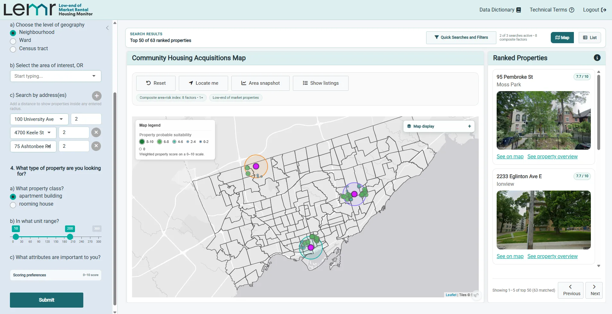
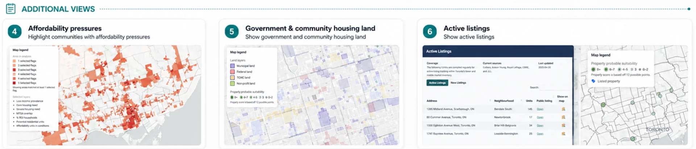

```{=html}
<a class="skip-link" href="#main-content">Skip to content</a>

<header class="site-header" aria-label="Primary">
  <a class="brand" href="#summary" aria-label="LEMR Community Housing Acquisition Tool home">
    
    <span class="brand-name">Community Housing Acquisition Tool</span>
  </a>
  <a class="header-link" href="#how-it-works">See how it works <span aria-hidden="true">↓</span></a>
</header>

<div id="main-content">
  <aside class="demo-notice section-shell" role="note">
    <p><strong>Note:</strong> This website is for unofficial demonstration purposes. An official webpage for the LEMR platform will be available soon including information about accessing the tool.</p>
  </aside>

  <section class="summary section-shell" id="summary" aria-labelledby="summary-title">
    <div class="section-kicker">What it does</div>
    <div class="summary-grid">
      <h2 id="summary-title">Summary</h2>
      <div class="summary-copy">
        <p class="lead">LEMR brings property, planning, housing-need, demographic, and market information into one acquisition-screening workspace for community housing providers.</p>
        <p>This tool enables community housing providers to directly engage with real estate analytics software and to support identification of opportunities relevant to the community housing sector and to support decision making and funding application development. Teams can translate an acquisition strategy into a custom search, compare both listed and off-market opportunities, understand the context around a site, and export detailed reports for internal discussion.</p>
      </div>
    </div>
  </section>

  <section class="workflow" id="how-it-works" aria-labelledby="workflow-title">
    <div class="workflow-heading section-shell">
      <p class="section-kicker">Example workflow</p>
      <h2 id="workflow-title">See how the Tool Works</h2>
      <p>Follow one example workflow, from search to report.</p>
    </div>

    <article class="step section-shell" id="custom-search">
      <div class="step-copy">
        <span class="step-number">01</span>
        <p class="step-label">Define the opportunity</p>
        <h3>Complete a custom search</h3>
        <p>Specify property type, property size, and the strategic priorities that matter to your organization—for example, proximity to existing sites, preserving at-risk affordable housing, redevelopment potential, serving communities experiencing marginalization, or access to transit.</p>
        <p>Choose a target neighbourhood, census tract, or ward, or search within a set distance of one or more addresses, such as properties already in your portfolio.</p>
        <div class="feature-tags" aria-label="Custom search inputs"><span>Property fit</span><span>Acquisition strategy</span><span>Local need</span><span>Address radius</span></div>
      </div>
      <div class="step-media media-stack">
        <figure class="demo-figure">
          <div class="video-shell">
            <video class="demo-video" muted loop playsinline preload="metadata" poster="assets/media/posters/custom-search.jpg" aria-label="LEMR custom search demonstration">
              <source src="assets/media/custom-search.mp4" type="video/mp4">
            </video>
            <button class="video-control" type="button" aria-label="Play custom search demonstration" data-state="paused"><span aria-hidden="true">▶</span></button>
          </div>
          <figcaption>Set the geography, property requirements, and scoring preferences that define a strong fit.</figcaption>
        </figure>
        <figure class="still-figure">
          
          <figcaption>An illustrative portfolio-based search using ONPHA offices, York University, and Centennial College as sample addresses.</figcaption>
        </figure>
      </div>
    </article>

    <article class="step section-shell" id="browse-properties">
      <div class="step-copy">
        <span class="step-number">02</span>
        <p class="step-label">Move from many to a shortlist</p>
        <h3>Browse and filter properties</h3>
        <p>Properties are filtered, scored, and ranked according to your inputs. Listed properties are identified alongside opportunities that are not currently on the market.</p>
        <p>Review results in the ranked-property panel, inspect their location on the map, or switch to the list view for a more detailed comparison.</p>
        <div class="feature-tags" aria-label="Property browsing views"><span>Ranked panel</span><span>Map view</span><span>List view</span><span>Listing status</span></div>
      </div>
      <div class="step-media">
        <figure class="demo-figure">
          <div class="video-shell">
            <video class="demo-video" muted loop playsinline preload="metadata" poster="assets/media/posters/browse-properties.jpg" aria-label="LEMR browse and filter properties demonstration">
              <source src="assets/media/browse-properties.mp4" type="video/mp4">
            </video>
            <button class="video-control" type="button" aria-label="Play browse properties demonstration" data-state="paused"><span aria-hidden="true">▶</span></button>
          </div>
          <figcaption>Move between map and list views while keeping the same ranked search results in focus.</figcaption>
        </figure>
      </div>
    </article>

    <article class="step section-shell" id="explore-context">
      <div class="step-copy">
        <span class="step-number">03</span>
        <p class="step-label">Understand what surrounds a site</p>
        <h3>Explore neighbourhood context and amenities</h3>
        <p>Adjust the map to show housing need, demographic patterns, and market trends. Build a composite indicator from the measures most important to your organization.</p>
        <p>Add context layers such as transit, nearby non-profit land, and government-owned land, then zoom from citywide patterns to the blocks surrounding a candidate property.</p>
        <div class="feature-tags" aria-label="Neighbourhood context layers"><span>Housing need</span><span>Demographics</span><span>Market trends</span><span>Transit &amp; land</span></div>
      </div>
      <div class="step-media">
        <figure class="demo-figure">
          <div class="video-shell">
            <video class="demo-video" muted loop playsinline preload="metadata" poster="assets/media/posters/explore-context.jpg" aria-label="LEMR neighbourhood context and amenities demonstration">
              <source src="assets/media/explore-context.mp4" type="video/mp4">
            </video>
            <button class="video-control" type="button" aria-label="Play neighbourhood context demonstration" data-state="paused"><span aria-hidden="true">▶</span></button>
          </div>
          <figcaption>Layer transit, affordability, land ownership, and other indicators directly onto the opportunity map.</figcaption>
        </figure>
      </div>
    </article>

    <article class="step section-shell" id="property-report">
      <div class="step-copy">
        <span class="step-number">04</span>
        <p class="step-label">Bring site evidence together</p>
        <h3>Generate a property report</h3>
        <p>Create an exportable overview of a candidate property, including key site metrics, pricing and acquisition flags, amenities and maintenance information, land and zoning context, building evaluations, inspection history, recent permits, and aerial imagery.</p>
        <p>Potential concerns and missing information are surfaced as prompts for follow-up, helping the team focus the next stage of due diligence.</p>
        <div class="feature-tags" aria-label="Property report contents"><span>Strategic fit</span><span>Risk flags</span><span>Building condition</span><span>Zoning &amp; permits</span></div>
      </div>
      <div class="step-media">
        <figure class="demo-figure">
          <div class="video-shell report-video">
            <video class="demo-video" muted loop playsinline preload="metadata" poster="assets/media/posters/property-report.jpg" aria-label="LEMR property report demonstration">
              <source src="assets/media/property-report.mp4" type="video/mp4">
            </video>
            <button class="video-control" type="button" aria-label="Play property report demonstration" data-state="paused"><span aria-hidden="true">▶</span></button>
          </div>
          <figcaption>Review site, building, inspection, permit, and zoning information in one consistent report.</figcaption>
        </figure>
      </div>
    </article>

    <article class="step section-shell" id="area-snapshot">
      <div class="step-copy">
        <span class="step-number">05</span>
        <p class="step-label">See the broader acquisition context</p>
        <h3>Generate an area snapshot report</h3>
        <p>Summarize the selected neighbourhood or search area with a map and overview, the properties matching your criteria, and a demographic and socioeconomic profile.</p>
        <p>The snapshot also brings in local real estate and development activity, lower-end-of-market rental trends, and residential building-permit information—useful context for comparing areas and briefing decision-makers.</p>
        <div class="feature-tags" aria-label="Area snapshot contents"><span>Neighbourhood profile</span><span>Demographics</span><span>Market pressures</span><span>Housing need</span></div>
      </div>
      <div class="step-media">
        <figure class="demo-figure">
          <div class="video-shell report-video">
            <video class="demo-video" muted loop playsinline preload="metadata" poster="assets/media/posters/area-snapshot.jpg" aria-label="LEMR area snapshot report demonstration">
              <source src="assets/media/area-snapshot.mp4" type="video/mp4">
            </video>
            <button class="video-control" type="button" aria-label="Play area snapshot demonstration" data-state="paused"><span aria-hidden="true">▶</span></button>
          </div>
          <figcaption>Compare local demographics, development patterns, matching properties, and market context in one snapshot.</figcaption>
        </figure>
      </div>
    </article>

    <article class="step step-wide section-shell" id="additional-views">
      <div class="step-copy">
        <span class="step-number">06</span>
        <p class="step-label">Return to recurring questions quickly</p>
        <h3>Apply filters or use pre-set Quick Searches</h3>
        <p>Build your own filter combinations or jump directly to high-value views. For example, highlight areas experiencing affordability pressure, map government and community-housing land, or focus on active listings.</p>
        <p>Quick Searches create a consistent starting point for common acquisition questions while leaving the underlying filters open for refinement.</p>
        <div class="feature-tags" aria-label="Example quick searches"><span>Affordability pressure</span><span>Public &amp; non-profit land</span><span>Active listings</span></div>
      </div>
      <div class="step-media">
        <figure class="still-figure wide-still">
          
          <figcaption>Examples of pre-set views that surface recurring, high-value acquisition questions.</figcaption>
        </figure>
      </div>
    </article>
  </section>

</div>

<footer class="site-footer">
  <div class="section-shell">
    <p><strong>LEMR Community Housing Acquisition Tool</strong></p>
    <p>A real estate analytics platform built for the community housing sector.</p>
  </div>
</footer>
```
